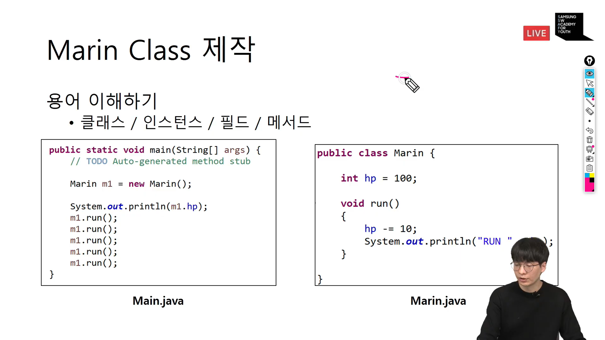

#OOP 분석 및 설계
- 품질 좋은 SW를 만들기 위한 일환
## 품질이 좋은 SW란?
1. 분석이 분명하고 쉬워야 한다.
    - 분명하면서 이해가 잘 되어야 한다.
    - 복잡도가 낮아야 한다.
    
2. 설계가 탄탄해야 한다.
    - 유지보수가 효과적이어야 한다.
    - 테스트가 좋아야 한다.
    - 확장이 쉬워야 한다.
    
3. 분석 / 설계 / 구현에 빈틈이 없어야 한다.

## 이러한 개발을 하기 위해서는? 
- 개발 전 분석과 설계 철저히
- 분석과 설계에 miscommunication 없도록 문서화 한다.
- Agile 개발 프로세스
- 코드리뷰 / TDD / Clean Code 등..

OOAD? (Object-Oriented Analysis and Design)
- 

## UML
- 객체 지향 설계의 표기법의 표준
- 분석 / 설계의 최종 결과물 -> UML Diagram

## 실습도구
- Build Test
    - C++, Java
    
- UML 도구
    - `draw.io`

##OOP 개요 1
- 객체지향 개발 방법이 필요했던 이유 1
    - 절자 치향 개발 : 절차대로 개발한다.
        - 작은 규모의 개발, 혼자 개발하는데 불편함은 없음
        - 큰 규모의 개발 -> 독립적으로 수행하는 역할을 나누어 운영하는 시스템화가 필요함
    - 재사용성이 좋음
        - 커피숍이 아닌 새로운 한정식집을 오픈해도 요리사만 교체하고, 다른 모듈은 그대로 재사용 가능
    - 이러한 것을 절차지향으로 개발을 한다면?
        - 여러 용도로 쓰이는 함수들이 많아짐으로써, 소스코드 변경시 여러 곳에 영향을 끼쳐 유지보수가 어려움
        - 협업이 어려워서 역할 분배 / 기능추가로 인해 Side Effect 논의 필요함
    
## 재사용성에 대한 이해
- ex) 스타1 -> 스타 2
    - 기존 함수를 그대로 사용 불가
    - 소스코드 분석 후 수정 필요
    
## 클래스의 등장
- 객체 단위로 구현하기 시작
    - 클래스로 객체를 구현
    
- C언어
    - 전역변수 / 함수 중심의 개발
    
- C++ / java
    - 클래스(전역변수 + 함수)중심의 개발

## Marin Class 제작
- 용어 이해하기
    - 클래스 / 인스턴스 / 필드 / 메서드

      
## Server Code와 Client Code
- Server Code
    - Client 요청을 받으면, 처리해주는 코드
    - Library == Server Code
    
- Client Code
    - Server Code에게 일을 요청하는 코드
    - Library 사용자 == Client Code
    
## Calculator 제작
- Server Code 구현
    - Calculator Class 제작
    - plus / minus / divide / multiple 메서드
        - 두 수를 받고, 계산 결과를 result 필드에 저장
    - printResult 메서드
        - result 결과를 화면에 출력
    
- Client Code 구현
    - 인스턴스 생성 후, 메서드 호출
    - printResult 메서드 호출하여 결과 확인
    
- 유튜브 라이브 다시보기 참조

## 캡슐화
- Server와 Client Code 관점에서 캡슐화를 이해한다.
- client는 Readme를 읽지 않는다.
